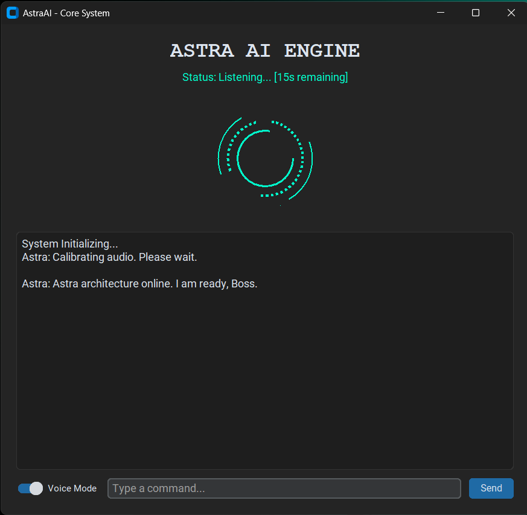

# Astra - Local Offline AI Assistant


A fully localized, stateful artificial intelligence assistant built with Python. Designed to prioritize privacy and local system control, this application routes natural language processing through a locally hosted Llama 3.1 model while executing custom OS-level operations without relying on third-party cloud APIs.

## System Architecture

* **Stateful Conversational Memory:** Implements a rolling context window (FIFO buffer) that retains recent conversation history and dynamically injects real-time clock data into the system prompt for complete temporal awareness.
* **Whitelist Tool Router:** A custom failsafe mechanism that parses user intent for action keywords. It dynamically grants or revokes the LLM's access to local PC tools, preventing AI hallucination when executing system commands.
* **Asynchronous Neural Audio:** Utilizes edge-tts for hyper-realistic voice generation. Audio processing is threaded asynchronously to prevent GUI blocking, utilizing dynamic file generation to bypass Windows file-lock permissions during rapid multi-turn conversations.
* **Non-Blocking UI & Background Protocols:** Built with CustomTkinter for a modern visual interface. Intercepts standard Windows kill-signals to withdraw the application into a pystray system tray background process rather than terminating.

## Interface Preview



## Tech Stack

* **Language:** Python 3.12
* **AI Core:** Ollama (Llama 3.1)
* **GUI:** CustomTkinter, Pillow
* **Audio Engineering:** Pygame, Edge-TTS, SpeechRecognition
* **Thread Management:** Python threading, asyncio

## Installation & Usage

1. Clone the repository:
   ```bash
   git clone https://github.com/AkshatSingh-90056/astra-desktop.git
   ```
2. Activate the virtual environment and install dependencies:
   ```bash
   pip install -r requirements.txt
   ```
3. Ensure Ollama is installed and running llama3.1 locally.
4. Launch the application:
   ```bash
   python src/AstraAI.py
   ```

## Engineering Focus

The primary goal of this project was to bridge the gap between heavy backend AI processing and responsive frontend GUI design. By managing custom execution threads and building a strict tool-routing protocol, Astra operates as a reliable, production-grade desktop utility rather than a simple API wrapper.